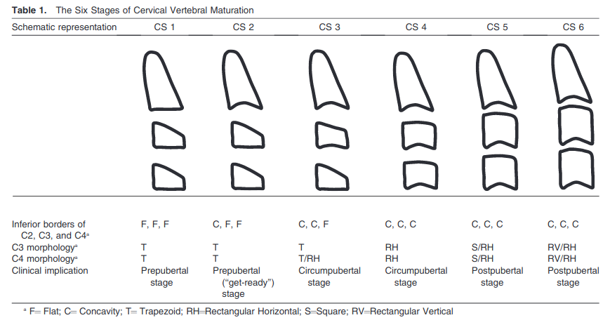

# Bone Age Maturity estimation using a Lateral Cephalogram X-ray image and deep neural networks
In this repository we collect the tools for the development of the X-ray image analysis for the purpose of _bone age maturity_ estimation. Bone age maturity is a key factor in designing interventions in orthodontics and dentofacial orthopedics. Bone age maturity estimation via lateral cephalogram images can be done by following the heuristics provided by _[McNamara and Franchi, "The cervical vertebral maturation method: A user’s guide", 2018](https://www.ncbi.nlm.nih.gov/pmc/articles/PMC8312535/)_. 

Bone age maturity can be discretized into 6 levels, though bone age maturity itself is a continuous variable. The 6 bone age maturity stages are as follows,

- S1 - Prepubertal Growth Period: This stage typically occurs before the onset of puberty and is characterized by minimal growth and development.

- S2 - Pubertal Growth Spurt Onset: The onset of the pubertal growth spurt, marked by the acceleration of growth and the development of secondary sexual characteristics.

- S3 - Peak of Pubertal Growth: The period of maximum growth velocity during puberty.

- S4 - Slowing Down of Pubertal Growth: Growth slows down after reaching the peak of pubertal growth.

- S5 - Postpubertal Growth: Growth continues, but at a slower rate than during puberty.

- S6 - Adult: Skeletal maturity is reached, and growth is complete.


Identifying the true value of bone age maturity stage requires taking an X-ray image from the left's hand and wrist of indiviuals in addition to the lateral cephalogram images that are taken in orthodontics and dentofacial orthopedics visits. To avoid taking the extra wrist X-ray image, one can estimate the bone age maturity from the morphology and shape of the cervical vertebrae which are usually visible in the lateral cephalogram images. In particular, the three vertebrae C2, C3, and C4 are the ones that have been studied. See the image below for the heuristics proposed by McNamara and Franchi.




## Our implementation

In order to apply McNamara and Franchi's heuristics, we need to have the shapes of C3 and C4 as well as the lower edge of C2 extracted from lateral cephalogram images. For this part, we rely on automated landmark detection using deep neural networks. We have a UNet model with heatmap outputs containing Gaussians centered around the landmarks. Given the size of the dataset, we utilize transfer learning with a pretrained efficientnet-b2 encoder backbone and extensive data augmentation during the training.

Major dependencies:

- Pytorch 2
- torchvision
- pytorch-lightning
- opencv
- scikit-image
- Pillow
- wandb
- h5py
- segmentation-models-pytorch
- ray
- jupyterlab
- numpy
- pandas


## Instructions

**Note!** whenever you see a `.keep` file inside a directory, ignore it. It is used only for adding empty directories to git.

**Note!** Do not commit any of the dataset files to git as it slows down the interaction with Github. Also, once we track data with git and push them to Github, we violate the data security and privacy principles! For data versioning and tracking, we may need to use other advanced tools and techniques. More on this to come if it becomes a bottleneck!

### Clone and branch steup

Clone the repo first. Then, create your own git branch and start developing on your own branch. You cannot push
any commit to `master` branch. 

### Data download

You need to download the data yourself and place them into the correct place as described below. Please note that you need to be part of the project team in order to gain access to some of the data we have gathered.

**Note! we are going to publish the dataset in the beginning of 2024! So, stay tuned!**


### Experimentation and development

Please carry out your own experimentation in jupyter notebooks first (`notebooks/` directory). Once we you done with experimentation, you can move the source code to the `cvmt/` directory. You make a pull request and the code gets reviewed and then merged. The code stored in the `cvmt/` directory gets packaged.

### Code config

It is best to separate the configuration and hyperparameters from the source code. Please, use the `configs/` directory for storing these configuration files. Since we are using `wandb` for experiment tracking, you must create a `.env` file inside the `configs/` directory and populate it with the following lines of code. Note that you must insert your own credentials to the showed placeholders with this `<>` sign. If you do not have a `wandb` account, go ahead and create one as you will need it. It is free!

* wandb-specific parameters
    - export WANDB_API_KEY=<>
    - export WANDB_CACHE_DIR="artifacts"
    - export WANDB_DIR="artifacts"
    - export WANDB_USERNAME=<>
    - export WANDB_ENTITY=<>
    - export WANDB_USER_EMAIL=<>

**All the parameters and hyperparameters used in the code are specified in `configs/params.yaml`**. There are lots of tweaks and tricks that you can apply simply via changing the parameters in `params.yaml` file without any need to touch the code. That is, the code has a fairly high parametrization that may seem uncessary for this use-case!

### Setting up the development environment

Make sure you have the repo cloned and your terminal is pointing to the root of the repo. Do this via the lines below,

```bash
git clone git@github.com:saeedmehrang/cvmt.git
cd cvmt/

```

1. python virtualenv

you can use python virtual-environment for isolation of development from the default python. Use the command below in your terminal to create a virtual environment named `venv`. Upgrade the pip version also.

```bash
python3 -m venv cephal

```

Activate the environment and install the dependencies for development work. Note that the torch related packages in requirements-dev are specifically set to GPU mode. If you have no GPU available, please visit `pytorch.org` and change package version and --index-url in `requirements-dev.txt` file to a CPU-only installation.

```bash
source cephal/bin/activate
pip3 install --upgrade pip
pip3 install -r environment/pip/requirements-dev.txt
pip3 install -e .
```

2. Conda/miniconda

First, install miniconda or conda in your system by following the instructions in the link below,

https://docs.conda.io/projects/conda/en/latest/user-guide/install/linux.html

Then, create a conda env and install the depencencies using the line below,

```bash
conda env create -f environment/conda/environment.yml
pip3 install -e .
```

3. Docker

TO BE DEVELOPED AND COMPLETED!

#### Dataset description
We have gathered lateral cephalogram X-ray images from different clinics and composed a dataset of over 800 images.
These images were annotated by two near graduation dentistry students from the Isfahan University of Medical Sciences.
The images come with varying levels of resolution and quality. Some were primarily digital and others were analogue images
that were scanned and digitized.

Download the zip files of the 4 batches of data we have included in this project from the link below and place them into the `data/intermediate/` directory which is by default an empty directory and already incldude in the git repo.

We have adopted a **_layered data engineering_** approach with 3 layers in which the data is prepared and processed from the very raw unstructured and untyped format (aka raw or bronze zone), to semi-structured format (aka intermediate or silver zone) all the way to the cleaned, typed, and harmonized format (aka primary or gold zone). In the case of this project, out input data was not too raw and unstructured, but rather semi-structured. As a result, our raw (or bronze) zone is empty and the data lands in the intermediate (or silver) zone. **This means that when you get access to the dataset and download it, you should move it under the `data/intermediate/` directory.**

### Dataset description

* first batch: 
A collection of digital and analogue lateral cephalogram X-ray images which are collected in Isfahan University of Medical Sciences. These images were annotated with vertebral landmarks by our project team.

* second batch:
A collection of digital lateral cephalogram X-ray images which are collected from a radiology clinic in Tehran. These images were annotated with vertebral landmarks by our project team.

* third batch:
A collection of images which are collected from open-source ISBI challenge 2014 and 2015 targeted at the detection of anatomical landmarks of the facial skeleton seen through lateral cephalogram X-ray images. These images were annotated with vertebral landmarks by our project team.

* fourth batch:
A collection of digital and analogue lateral cephalogram X-ray images which are collected in Isfahan University of Medical Sciences and annotated with vertebral landmarks by our project team.

* fifth batch:
A golden test dataset with bone age maturity levels, but without any vertebral landmarks. This dataset is used to benchmark the performance of the whole system. This dataset was not accessed by the data science team until the development of the deep learning models and the whole pipeline was fully ready.

## Highlevel description of the code

The current cvmt package supports the following isolated (pipeline) steps,

["data_prep", "train_test_split", "train", "verify", "test", "inference"]

You can run each of these steps as many times as you want through `main.py` (more instructions on how to call the code below). We have integrated _weights and biases (wandb)_ for experiment tracking. Therefore, each time you call `main.py`, a new wandb run is created for you and the logging happens for params, artifacts, git commit hash, the whole repository  remotely. There is also the `artifacts/` directory located inside the root of the repo that holds some of the wandb artifacts locally. 

**Resuming a previosuly created wandb run**: if this is desired, set the parameter `id` under `WANDB.INIT` to the string id of the run as seen through wandb portal or api and then the other parameter `resume` to the string value `must`. This way wandb is forced to resume a previously created run! 

You are advised not to run _"test"_ step in your development process unless you are completely done with all the development, training, and fine-tuning the prior steps. The _"train\_test\_split"_ creates _"validation"_ set out of the input datasets and you must use that one for measuring your goodness of fit and overal performance of the code during the development.

To simplify and standardize the parametrization and logging of the parameters, there is a single `configs/params.yaml` file that stores all the input parameters. This yaml file gets parsed firsthand when you call `main.py` and is passed to all the steps mentioned above. 

MORE INSTRUCTIONS ON HOW TO SPECIFY THE PARAMS WILL BE ADDED HERE, SOON!

### step: data_prep

Prepare the data by performing cleaning and harmonization to _.hdf5_ format. The source data formats are _.jpg_ for images and _.json_ for vertebral landmark annotations. In this step, all of these are stored into a single _.hdf5_ file with highest compression level. These _.hdf5_ files are used directly by torch dataloader in the training phase.

There is also a metadata table created out of the _"data\_prep"_ step and written next to the harmonized _.hdf5_ files. This metadata table is also a _.hdf5_ table.

All the outputs of this step is written to the `data/primary/` directory.

Note! Ray library is used for parallel processing of the input data in this step.

Run this step by,

```bash
python3 -m main --step data_prep
```

### step: train_test_split

This step splits the data into training, validation, and test sets. The input for this step is the `metadata.hdf5` table that is created in previous step. 

Note! the ratio of the splitting is unfortunately hardcoded inside the code, but one can easily parametrize that and specify it in `params.yaml` file!

Run this step by,

```bash
python3 -m main --step train_test_split
```

### step: train

This step performs the training. Given that in the data_prep step, we do an edge detection using _gaussian\_gradient\_magnitude_ technique, one can perform an auxiliary training with edges as the target of the UNet model before training for vertebral landmark detection. Similarly, with a few tiny changes, one can perform an auxiliary training for image reconstruction where the input and output of the UNet model are the same.

Run pre-training step with auxiliary _edge detection_ by,

```bash
python3 -m main --step train --training-task edges
```

Run training step for _landmark detection_ by,

```bash
python3 -m main --step train --training-task v_landmarks
```

Note! If you would like continue training a pre-trained model, you should specify the parameter `CHECKPOINT_PATH` inside `params.yaml`. This parameter is set to `null` by default and as a result ignored by the code. Given that we are using wandb for experiment tracking, one can download any checkpoint using wandb api and then supply its path to the training code via the parameter `CHECKPOINT_PATH`. 


### step: verify

The verification step is usually a must-have in sensitive applications and use-cases such as medical data analysis. In the verification step, the code downloads a checkpoint from the wandb artifact store and place it under the `artifacts/artifacts` directory. This checkpoint will be used to perform landmark detection. Then, there are an integer `N_IMGAES_TO_PLOT` randomly created and saved to the directory `artifacts/verification` exclusively for highly accurate samples (top 25th percentile), mid-accurate samples (25th to 75th percentiles), and not too accurate samples (bottom 25th percentile). In addition, histogram of per image mean radial error is also created and saved to the same directory. At the end of this step, an expert human can go through the figures and verify whether the implemented logic and the trained UNet model are good enough.

Note! you are advised to use `validation set` for verification during the development work.

Run this step for validation set by,

```bash
python3 -m main --step verify --verify-split val
```


Run this step for test set by,

```bash
python3 -m main --step verify --verify-split test
```

### step: test

To be executed only at the end of the development, training, and fine-tuning of the code and the deep neural network model. This step is somehow similar to verification step above if run for _test split_. This step simply measures the loss and the mean radial error for all the samples in the test set and logs them with wandb.

Remember that you must run _verification_ step (preferrably on validation set) at least once before runing this step! This is how the logic is designed so that it makes sure a _human interpreter_ has already seen the verification results for validation set and it is safe to conclude the development by running the test step and logging the performance. This test set performance is the final one that you should report!

Run this step by,

```bash
python3 -m main --step test
```

### step: inference

If you would like to run a single image through the whole pipeline and get the bone age maturity stage of that image, you can do it using this step. The output is printed in the terminal!

Run this step by,

```bash
python3 -m main --inference test --filepath <"path to the image file"> --pix2cm <"integer number showing the number of pixels per each centimeter in the image">
```

## Next steps

- we are planning to publish our results and our dataset asap in 2024.
- we are planning to move the deep learning part of the code base to another repository and enhance its capabilities and algorithms.

## Interested to join as a contributer?

Please fill-in the Google form below and we will contact you asap.

[Contribution sign-up Google form](https://docs.google.com/forms/d/e/1FAIpQLScSSYE4tMMYs5ZHRXEeVoBtC39yl5aSDwZ3W3BjZD1MG8mRtA/viewform?usp=sf_link)